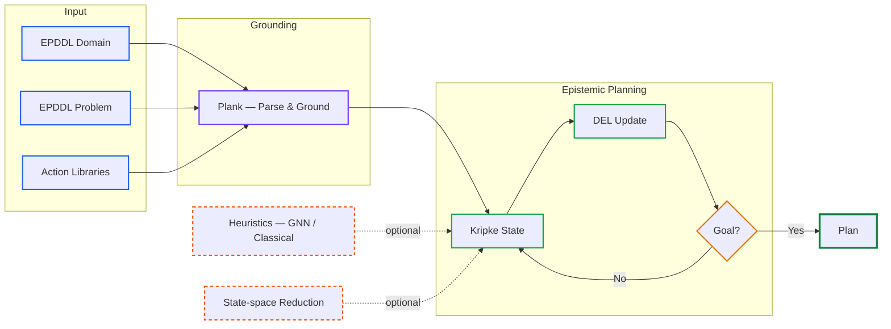

# deep

### Dynamic Epistemic logic-basEd Planner

**deep** is a C++20 multi-agent epistemic planner based on **EPDDL** and **Dynamic Epistemic Logic (DEL)**.

Given an epistemic planning domain and problem, deep grounds the task, constructs the corresponding epistemic state, and searches for a sequence of DEL actions that satisfies the goal.

**[EPDDL Guideline](https://arxiv.org/abs/2601.20969)** ·
**[IPC 2026 Benchmarks](https://github.com/ipc2026-epistemic/benchmarks)** ·
**[GNN Heuristics](https://arxiv.org/abs/2508.12840)**

---

## At a glance



The core planner uses **Plank** to parse and ground EPDDL tasks. Search operates over Kripke states, with **DEL event-model update** providing the transition semantics. Heuristics and state-space reduction techniques can optionally guide and reduce the search.

### Features

- EPDDL domains, problems, and action libraries
- DEL-based epistemic transitions
- Multi-agent Kripke-state search
- BFS, DFS, IDFS, heuristic search, A*, and RL-oriented search
- Optional visited-state checking and bisimulation
- GNN-based heuristic evaluation
- Dataset-generation infrastructure
- Native ONNX Runtime inference
- Optional Linux/NVIDIA GPU inference

### References

**deep / GNN-derived heuristics**

> Giovanni Briglia, Francesco Fabiano, and Stefano Mariani.  
> *Scaling Multi-Agent Epistemic Planning through GNN-Derived Heuristics.*  
> arXiv:2508.12840, 2025.

**EPDDL**

> Alessandro Burigana and Francesco Fabiano.  
> *The Epistemic Planning Domain Definition Language: Official Guideline.*  
> arXiv:2601.20969, 2026.

---

## Installation

### Clone

Clone deep and its submodules:

```bash
git clone --recurse-submodules \
  https://github.com/FrancescoFabiano/deep.git

cd deep
```

For an existing checkout:

```bash
git submodule sync --recursive
git submodule update --init --recursive
```

### Dependencies

deep uses the following external components:

| Component | Purpose | Repository |
| --- | --- | --- |
| **Plank** | EPDDL parsing, grounding, and DEL infrastructure | [a-burigana/plank](https://github.com/a-burigana/plank) |
| **xxHash** | Fast hashing | [Cyan4973/xxHash](https://github.com/Cyan4973/xxHash) |
| **CLI11** | Command-line interface | [CLIUtils/CLI11](https://github.com/CLIUtils/CLI11) |
| **IPC 2026 Benchmarks** | EPDDL benchmark suite | [ipc2026-epistemic/benchmarks](https://github.com/ipc2026-epistemic/benchmarks) |

These dependencies are versioned as Git submodules.

Neural-network builds additionally use [ONNX Runtime](https://github.com/microsoft/onnxruntime), which is downloaded automatically when required.

### System requirements

deep requires:

- a C++20 compiler;
- CMake 3.14 or newer;
- Boost;
- Git;
- `curl`;
- `unzip`.

On Ubuntu/Debian:

```bash
sudo apt-get update
sudo apt-get install \
  build-essential \
  cmake \
  libboost-dev \
  unzip \
  curl
```

On macOS, first install the Xcode Command Line Tools:

```bash
xcode-select --install
```

then install the required packages through [Homebrew](https://brew.sh/):

```bash
brew install cmake boost unzip curl
```

Alternatively, on either supported platform:

```bash
./build.sh install_all
```

### Build

Release build:

```bash
./build.sh
```

Debug build:

```bash
./build.sh debug
```

Build with neural-network support:

```bash
./build.sh nn
```

Debug build with neural-network support:

```bash
./build.sh debug nn
```

Optional correctness verification can be enabled with:

```bash
./build.sh verify
```

For Linux/NVIDIA GPU inference:

```bash
./build.sh nn use_gpu
```

See all build options with:

```bash
./build.sh -h
```

The executable is generated under the corresponding build directory, for example:

```text
cmake-build-release/bin/deep
```

---

## Running deep

The basic interface is:

```text
deep <domain.epddl> <problem.epddl> [options]
```

For example:

```bash
./cmake-build-release/bin/deep \
  path/to/domain.epddl \
  path/to/problem.epddl
```

### Action libraries

When the task uses one or more action libraries, provide each path with
`--act_lib`:

```bash
./cmake-build-release/bin/deep \
  path/to/domain.epddl \
  path/to/problem.epddl \
  --act_lib path/to/library_a.epddl \
  --act_lib path/to/library_b.epddl
```

### Common configurations

Default search:

```bash
./cmake-build-release/bin/deep \
  DOMAIN.epddl \
  PROBLEM.epddl \
  --act_lib LIBRARY.epddl
```

With visited-state checking:

```bash
./cmake-build-release/bin/deep \
  DOMAIN.epddl \
  PROBLEM.epddl \
  --act_lib LIBRARY.epddl \
  -c
```

With visited-state checking and bisimulation:

```bash
./cmake-build-release/bin/deep \
  DOMAIN.epddl \
  PROBLEM.epddl \
  --act_lib LIBRARY.epddl \
  -c -b
```

For all search strategies, heuristics, and configuration options:

```bash
./cmake-build-release/bin/deep -h
```

### CI smoke tests

The execution workflow validates the modern interface against
`utils/smoke_cases.tsv`, where each row specifies:

- an EPDDL domain file;
- an EPDDL problem file;
- an optional action library;
- optional grounded actions for `--execute_actions`.

Run the same smoke tests locally with:

```bash
./utils/smoke_test.sh \
  cmake-build-release/bin/deep
```

---

## IPC 2026 benchmarks

The IPC 2026 Epistemic Planning benchmark suite is included as a submodule at:

```text
exp/ipc2026-benchmarks/
```

Upstream:

**[ipc2026-epistemic/benchmarks](https://github.com/ipc2026-epistemic/benchmarks)**

Initialize it together with the other submodules:

```bash
git submodule update --init --recursive
```

Inspect the available instances with:

```bash
find exp/ipc2026-benchmarks \
  -type f \
  \( -name '*.epddl' -o -name '*.pddl' \) \
  | head -50
```

A benchmark can then be run as:

```bash
./cmake-build-release/bin/deep \
  exp/ipc2026-benchmarks/<benchmark>/domain.epddl \
  exp/ipc2026-benchmarks/<benchmark>/problems/<problem>.epddl \
  --act_lib exp/ipc2026-benchmarks/<benchmark>/<library>.epddl
```

Use the actual domain, problem, and library filenames contained in the checked-out benchmark revision.

---

## Architecture

### EPDDL and DEL

deep uses **EPDDL** as its input language and **Dynamic Epistemic Logic** as its transition semantics.

EPDDL domains, problems, and action libraries are processed using **Plank**,
which provides the parsing, grounding, model-checking, and DEL infrastructure
required by the planner.

The grounded task provides:

- the initial epistemic state;
- the epistemic goal;
- the grounded DEL actions available during search.

Search states are represented as **Kripke structures** with designated worlds,
and successor states are obtained by DEL product update with the corresponding
grounded action models.

For each grounded action, deep stores:

- the action's events and designated events;
- postconditions and preconditions for each event;
- one event relation for each grounded EPDDL observability type;
- formula-valued observability conditions selecting which relation applies to
  each agent in the current source state.

During successor generation, deep first resolves one observability type per
agent on the full source epistemic state, then expands the reachable product
model from designated `(world, event)` pairs.

### Search

deep provides several uninformed, heuristic, and learned search strategies.

State-space management can optionally use visited-state checking and bisimulation contraction. The exact configuration is controlled through the command-line interface.

### GNN heuristics

Kripke structures are naturally represented as labelled directed graphs. deep can translate epistemic states into graph tensors and evaluate them using GNN models through ONNX Runtime.

```text
Kripke state
     │
     ▼
Graph tensor
     │
     ▼
GNN
     │
     ▼
Heuristic estimate
```

The representation describes the epistemic state itself—including its graph structure and designated worlds—and is therefore not intrinsically tied to a particular EPDDL action fragment.

The effectiveness of a trained model nevertheless depends on its training distribution and should be evaluated on the target domains.

### mA* heuristics

> **Note:** Specialized heuristics designed for the mA* fragment should currently be used only for tasks known to satisfy the assumptions required by those heuristics.

Automatic recognition of compatible EPDDL fragments is planned. Until then, these heuristics should not be treated as general-purpose heuristics for arbitrary EPDDL tasks.

---

## Experiments

The current IPC benchmark source is:

```text
exp/ipc2026-benchmarks/
```

Experimental results should record the relevant planner configuration, including:

- benchmark revision;
- search strategy and heuristic;
- visited-state and bisimulation settings;
- comparison mode;
- neural model, when applicable;
- time and memory limits.

Experiment, testing, and dataset-generation utilities are available under:

```text
scripts/
```

---

## Known limitations

- Applicability of mA*-specific heuristics is not yet detected automatically.
- Learned models may require evaluation or retraining when moving to substantially different domain distributions.
- GPU ONNX inference currently targets Linux/NVIDIA environments.

---

## Future work

Current development directions include:

- **automatic EPDDL fragment detection**, allowing deep to enable compatible specialized heuristics automatically;
- **GNN/RL training and evaluation** on EPDDL and IPC benchmark distributions;
- improved generalization of learned heuristics across domains;
- further optimization of epistemic state generation, storage, and search.

---

## Repository structure

```text
deep/
├── src/                     planner implementation
│   ├── actions/
│   ├── bisimulation/
│   ├── domain/
│   ├── formulae/
│   ├── heuristics/
│   ├── parse/
│   ├── search/
│   ├── states/
│   └── utilities/
│
├── lib/
│   ├── plank/               EPDDL / DEL infrastructure
│   ├── CLI11/
│   ├── xxHash/
│   └── onnxruntime/         optional NN runtime
│
├── exp/
│   └── ipc2026-benchmarks/
│
├── scripts/
├── utils/
├── CMakeLists.txt
└── build.sh
```

---

## References

### deep

G. Briglia, F. Fabiano, and S. Mariani.  
**Scaling Multi-Agent Epistemic Planning through GNN-Derived Heuristics.**  
arXiv:2508.12840, 2025.  
[arXiv:2508.12840](https://arxiv.org/abs/2508.12840)

```bibtex
@misc{briglia2025scaling,
  title         = {Scaling Multi-Agent Epistemic Planning through GNN-Derived Heuristics},
  author        = {Briglia, Giovanni and Fabiano, Francesco and Mariani, Stefano},
  year          = {2025},
  eprint        = {2508.12840},
  archivePrefix = {arXiv},
  primaryClass  = {cs.AI},
  url           = {https://arxiv.org/abs/2508.12840}
}
```

### EPDDL

A. Burigana and F. Fabiano.  
**The Epistemic Planning Domain Definition Language: Official Guideline.**  
arXiv:2601.20969, 2026.  
[arXiv:2601.20969](https://arxiv.org/abs/2601.20969)

```bibtex
@misc{burigana2026epddl,
  title         = {The Epistemic Planning Domain Definition Language: Official Guideline},
  author        = {Burigana, Alessandro and Fabiano, Francesco},
  year          = {2026},
  eprint        = {2601.20969},
  archivePrefix = {arXiv},
  primaryClass  = {cs.AI},
  url           = {https://arxiv.org/abs/2601.20969}
}
```

### Related work

- A. Burigana and F. Fabiano. *The Epistemic Planning Domain Definition Language.* IPS 2022.
- F. Fabiano et al. *E-PDDL: A Standardized Way of Defining Epistemic Planning Problems.* 2021.
- F. Fabiano et al. *H-EFP: Bridging Efficiency in Multi-agent Epistemic Planning with Heuristics.* PRIMA 2024.
- F. Fabiano et al. *EFP 2.0: A Multi-Agent Epistemic Solver with Multiple E-State Representations.* ICAPS 2020.

---

## License

deep is distributed under the **GNU General Public License v3.0**.

See [`LICENSE`](LICENSE) for details.
